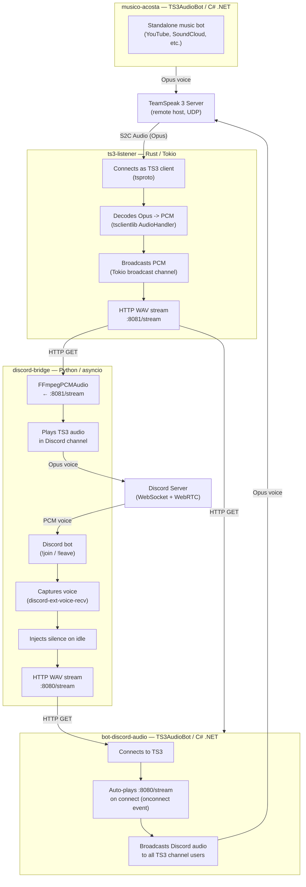
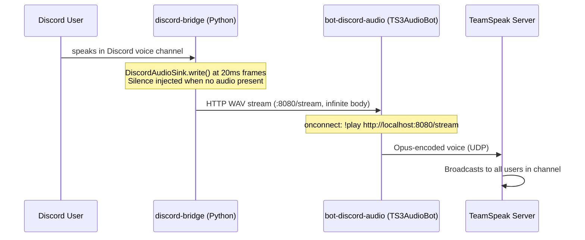
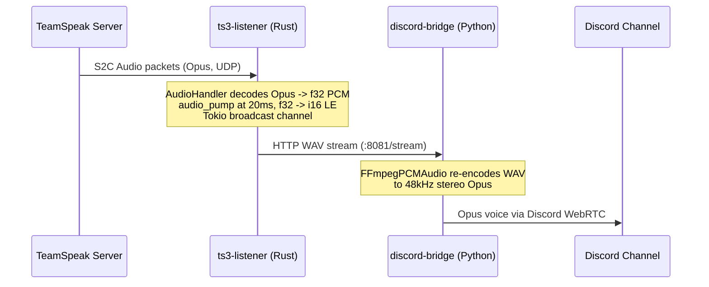

# ts-bot — Bidirectional TeamSpeak / Discord Audio Bridge

A real-time, bidirectional audio bridge that connects a **TeamSpeak 3** server to a **Discord** voice channel. Audio flows in both directions simultaneously, so users on either platform can hear each other with minimal latency.

Built with **Rust**, **Python (asyncio)**, and **C# (.NET)**, deployed as four independent Linux services managed by a single shell script.

---

## Architecture Overview



---

## Data Flow

### Discord → TeamSpeak



### TeamSpeak → Discord



---

## Services

| Service | Language | Role |
|---|---|---|
| `discord-bridge` | Python 3 / asyncio / discord.py | Discord bot + bidirectional HTTP audio gateway |
| `ts3-listener` | Rust / Tokio | TS3 client that captures voice → HTTP WAV stream |
| `bot-discord-audio` | C# / .NET 8 (TS3AudioBot) | TS3 bot that plays the Discord audio stream |
| `musico-acosta` | C# / .NET 8 (TS3AudioBot) | Standalone TS3 music bot |

---

## Tech Stack

| Component | Technology |
|---|---|
| TS3 client protocol | [tsproto](https://github.com/ReSpeak/tsclientlib) (Rust) |
| Opus decode | `tsclientlib::audio::AudioHandler` |
| Async runtime | Tokio (Rust), asyncio (Python) |
| HTTP audio streaming | Raw TCP + WAV chunked response (Rust), aiohttp (Python) |
| Discord voice | discord.py + discord-ext-voice-recv |
| TS3 bot engine | [TS3AudioBot](https://github.com/Splamy/TS3AudioBot) |
| Audio transcoding | FFmpeg (PCM ↔ Opus ↔ WAV) |
| Service management | Bash (`ts-bridge.sh`) |

---

## Project Structure

```
ts-bot/
├── ts-bridge.sh            # Unified service manager (start/stop/restart/status/logs)
├── config.env.example      # Configuration template
├── services/
│   ├── discord-bridge/
│   │   └── discord_bridge.py   # Main bridge bot
│   ├── bot-discord-audio/      # TS3AudioBot instance for Discord relay
│   │   ├── ts3audiobot.toml
│   │   └── bots/default/bot.toml
│   └── musico-acosta/          # TS3AudioBot instance for music
│       ├── ts3audiobot.toml
│       └── bots/default/bot.toml
├── ts3-listener/               # Rust TS3 listener source
│   └── src/main.rs
└── tsclientlib/                # tsclientlib dependency source
```

### Runtime layout (after setup, gitignored)

```
shared/
├── TS3AudioBot        # Binary (symlinked into services/)
├── ts3-listener       # Rust binary
├── discord-token.txt  # Discord bot token (keep private!)
└── lib/               # .NET runtime deps
```

---

## Setup

### 1. System Dependencies

```bash
# Ubuntu / Debian
sudo apt update && sudo apt install \
  ffmpeg \
  pkg-config libssl-dev cmake \
  libopus-dev \
  dotnet-sdk-8.0
```

### 2. Clone and Configure

```bash
git clone https://github.com/your-user/ts-bot.git
cd ts-bot

cp config.env.example config.env
# Edit config.env with your TS3 server address and paths
nano config.env
```

### 3. Place Binaries

Download a [TS3AudioBot release](https://github.com/Splamy/TS3AudioBot/releases) and place the binary + dependencies in `shared/`:

```bash
mkdir -p shared
cp /path/to/TS3AudioBot shared/
cp -r /path/to/lib shared/
cp -r /path/to/WebInterface shared/       # optional
cp /path/to/NLog.config shared/
cp /path/to/TS3AudioBot.dll.config shared/
```

### 4. Build the Rust Listener

```bash
cd ts3-listener
cargo build --release
cp target/release/ts3-listener ../shared/ts3-listener
cd ..
```

### 5. Set Up Symlinks

Each TS3AudioBot service instance needs symlinks to the shared binaries:

```bash
for svc in bot-discord-audio musico-acosta; do
  ln -s ../../shared/TS3AudioBot      services/$svc/TS3AudioBot
  ln -s ../../shared/lib              services/$svc/lib
  ln -s ../../shared/WebInterface     services/$svc/WebInterface
  ln -s ../../shared/NLog.config      services/$svc/NLog.config
  ln -s ../../shared/TS3AudioBot.dll.config services/$svc/TS3AudioBot.dll.config
done
ln -s ../../shared/ts3-listener services/bot-discord-mic/ts3-listener
```

### 6. Set Up the Python Bridge

```bash
python3 -m venv bridge-env
source bridge-env/bin/activate
pip install "discord.py[voice]" discord-ext-voice-recv aiohttp

echo "YOUR_BOT_TOKEN" > shared/discord-token.txt
```

### 7. Start Everything

```bash
./ts-bridge.sh start
./ts-bridge.sh status
```

---

## Management

```bash
./ts-bridge.sh start   [all|music|audio|mic|discord]
./ts-bridge.sh stop    [all|music|audio|mic|discord]
./ts-bridge.sh restart [all|music|audio|mic|discord]
./ts-bridge.sh status
./ts-bridge.sh logs    [music|audio|mic|discord]
```

---

## Discord Commands

| Command | Description |
|---|---|
| `!join` | Bot joins your voice channel and activates the bridge |
| `!leave` | Bot leaves and deactivates the bridge |

---

## Configuration

`config.env`:

```bash
TS3_ADDRESS="1.2.3.4"        # TeamSpeak server IP
TS3_PORT=9987
DISCORD_TOKEN_FILE="..."     # Path to Discord bot token file
DISCORD_STREAM_PORT=8080     # Discord audio → TS3 WAV stream
TS3_STREAM_PORT=8081         # TS3 audio → Discord WAV stream
DOTNET_SYSTEM_GLOBALIZATION_INVARIANT=1
```

---

## License

MIT
